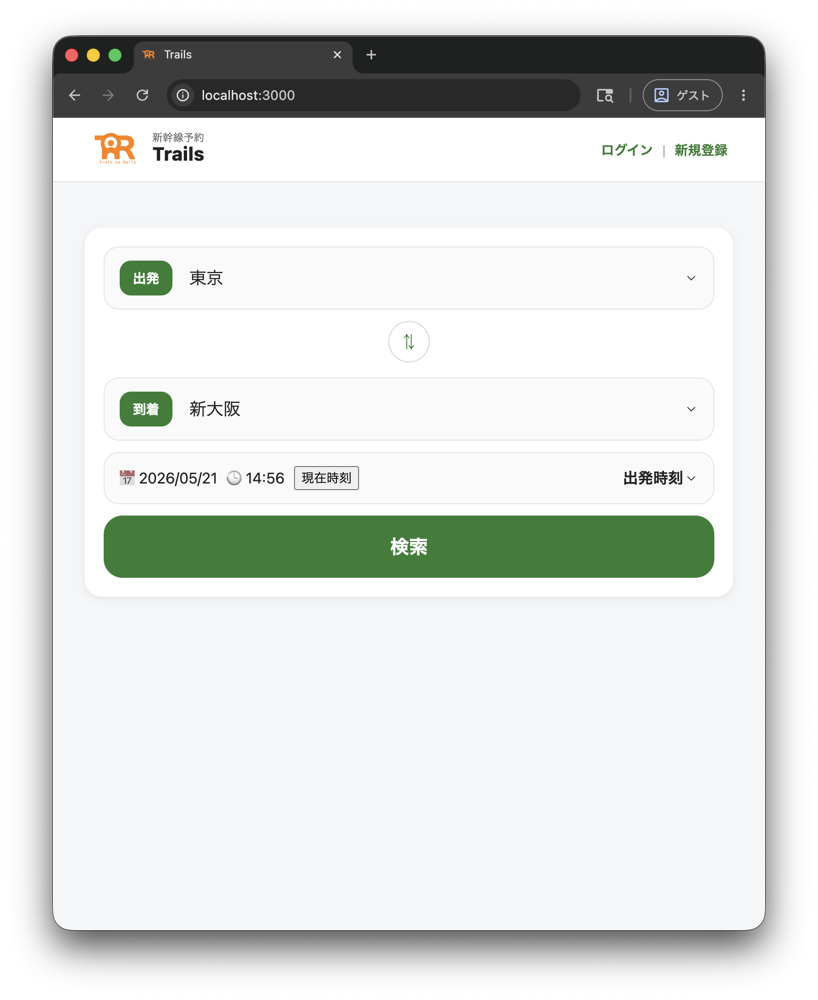
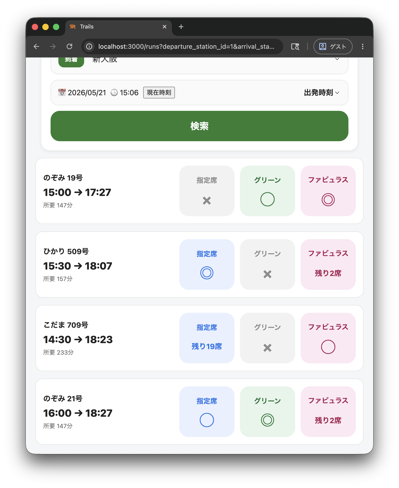
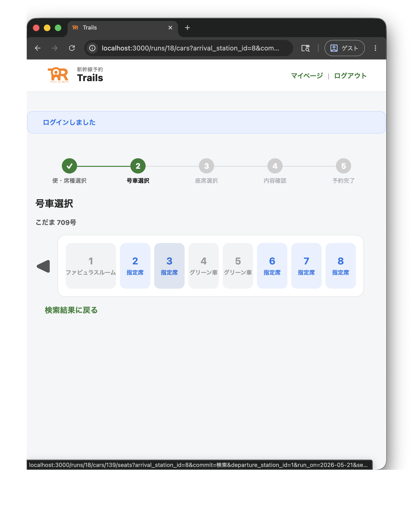
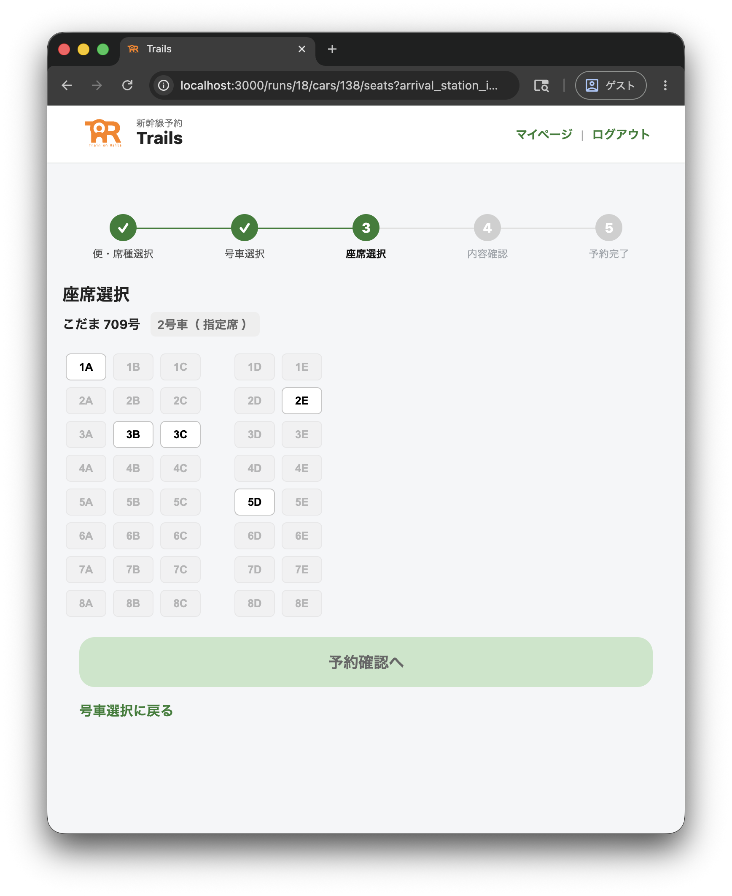
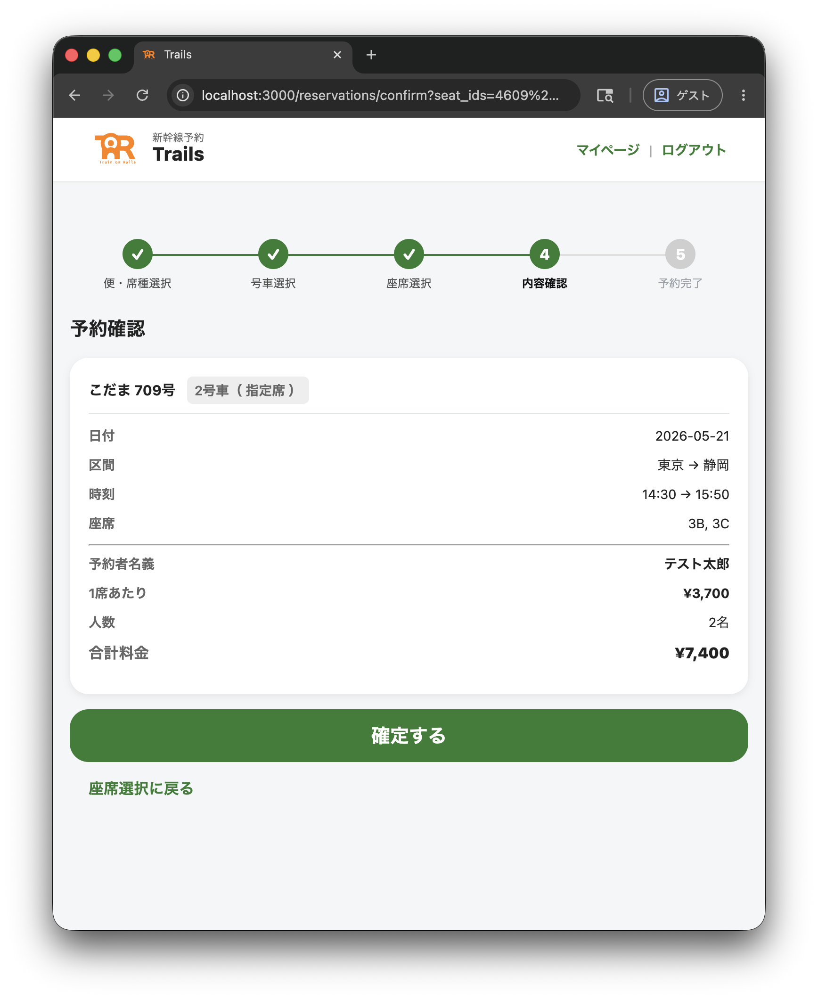
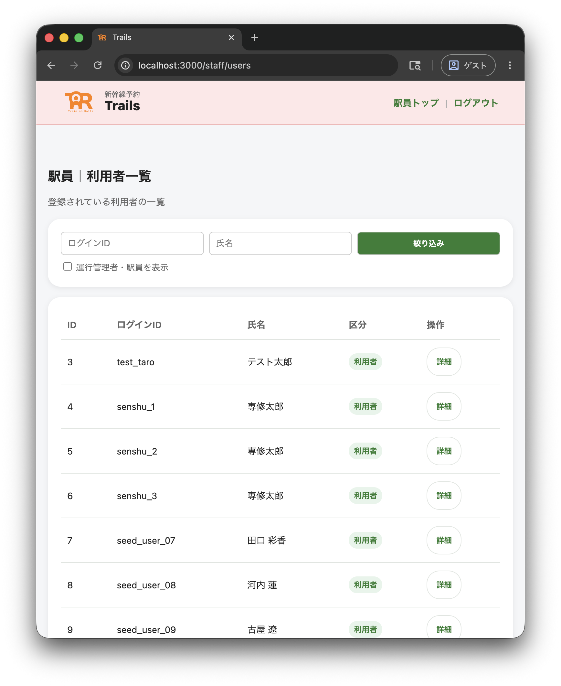

# 新幹線予約システム

Ruby on Rails を用いて開発する、新幹線の座席予約を模した Web アプリケーションである。  
利用者・駅員・運行管理者の3ロールを持ち、便検索、座席予約、発券管理、運行管理までを扱う。

## 主な機能

- 会員登録・ログイン
- 便検索（駅・日付・時刻指定）
- 座席選択（指定席／グリーン車／ファビュラスルーム）
- 予約確定・予約確認
- 利用者：予約・自己予約削除（未発券のみ）
- 駅員：代理予約・利用者検索・予約の詳細確認・発券状態管理
- 運行管理者：便追加・運行管理

## 実装・設計のポイント

- 利用者・駅員・運行管理者の3ロールで操作範囲を分離
- 座席は単純な予約済みフラグではなく、予約・座席・乗車区間を分けて管理
- 速達種別は、発駅・着駅の両方に停車する便のみ予約可能
- 同一座席でも、既存予約と乗車区間が重ならない場合は予約可能

## 画面イメージ

| 便検索 | 検索結果 |
| --- | --- |
|  |  |

| 号車選択 | 座席選択 |
| --- | --- |
|  |  |

| 予約確認 | 駅員画面 |
| --- | --- |
|  |  |

## 技術スタック

- Ruby 3.1.6
- Ruby on Rails 7.0.10
- SQLite3
- ERB / Sprockets
- Docker / Docker Compose

## Docker 起動方法

Docker が入っている環境で、以下のコマンドを実行する。

```bash
docker compose up --build
```

起動後、ブラウザで以下にアクセスする。

```text
http://localhost:3000
```

初回起動時は、確認に必要なデモデータを自動で投入する。
大量の残席パターンを追加したい場合は、任意で以下を実行する。

```bash
docker compose run --rm app bin/rails runner db/seeds/full_reservations.rb
```

### 確認用アカウント

| ロール | ログインID | パスワード |
| --- | --- | --- |
| 利用者（予約なし） | `test_user1` | `TestUser1!` |
| 駅員 | `staff_admin` | `StaffAdmin1234$` |
| 運行管理者 | `operator_admin` | `OperatorAdmin1234$` |

### データを初期化したい場合

```bash
docker compose run --rm app bin/rails db:reset
docker compose up
```

## 設計ドキュメント

- システム概要・業務ルール: [docs/overview.md](docs/overview.md)
- ER図: [docs/er.md](docs/er.md)
- テスト方針・観点: [docs/test.md](docs/test.md)
